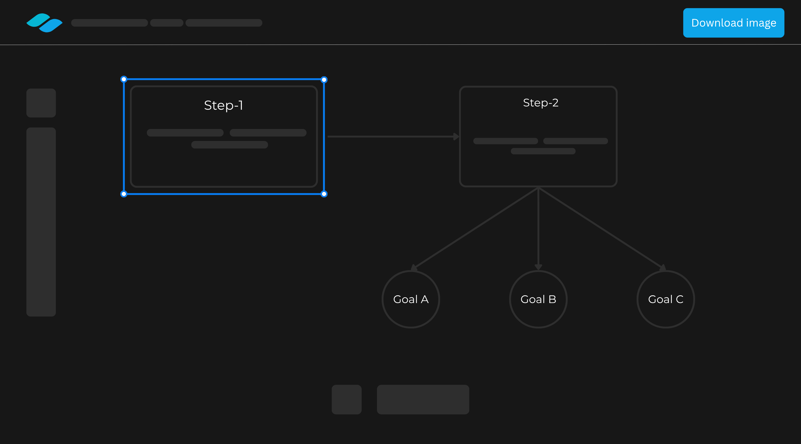

# 🎨 Drawwify — A Visual Drawing Tool To Draw Your Ideas And Mindmaps.

>**Status**: Beta V1  
>**Live Site**: [https://drawwify.in](https://drawwify.in)  
>**Backend API**: [https://api.drawwify.in](https://api.drawwify.in)

Drawwify is a lightweight, clean visual workspace built entirely on the raw HTML Canvas API. It allows users to draw, design, connect, and export visual ideas — all in the browser.

---

## 📁 Project Structure

```
drawwify/
├── Frontend/    # React.js + TailwindCSS client app
└── Backend/     # Node.js + Express.js + MongoDB API
```

---

## ✨ Features

- 🎨 Draw shapes like rectangles, circles, lines, arrows  
- 🔗 Connect elements visually for flow-based diagrams  
- 🧩 Customize styles: colors, borders, fonts, and more  
<!-- - ♻️ Undo/Redo support   -->
- 💾 Export canvas as image  
- 📥 Save & sync elements with server  
- 🔐 Auth with OAuth2 (Google)  
- 🛠️ Built **without** third-party canvas libraries (raw canvas API)

---

## 🚀 Getting Started

### 1. Clone the Repository

```bash
git https://github.com/developer-amarjeetBaraik/drawwify.in
cd drawwify
```

### 2. Setup Environment Variables

Create `.env` files in both `Frontend/` and `Backend/` directories using the provided `.env.example` templates.

---

### 3. Start the Frontend

```bash
cd Frontend
npm install
npm run dev
```

### 4. Start the Backend

```bash
cd Backend
npm install
npm run dev
```

---

## 🧪 Tech Stack

| Frontend              | Backend          | DevOps & Tools     |
|-----------------------|------------------|---------------------|
| React.js              | Node.js          | Vercel (Frontend)   |
| TailwindCSS           | Express.js       | Render (Backend)    |
| Context API           | MongoDB (Atlas)  | Git & GitHub        |
| HTML Canvas API       | JWT + OAuth2     | dotenv, middleware  |

---

## 📷 Screenshots



---

## 📦 Installation Notes

- Node.js `v16+` recommended  
- MongoDB Atlas used for DB (cluster connection required)  
- OAuth2 client credentials from Google Cloud Console

---

## 🧾 Environment Variables

Please refer to `.env.example` files in both folders. Here's a sample:

```
# Frontend/.env
VITE_BACKEND_URL = your_backend_url
VITE_BACKEND_GOOGLE_AUTH_ENDPOINT = your_backend_url/auth/google

# Backend/.env
PORT = you_can_define_your_backend_port       (optional)
NODE_ENV = your_code_phase                    (can be only - devlopment / testing / production)
GOOGLE_CLIENT_ID=your_google_client_id        (for OAuth 2.0 (google))
GOOGLE_CLIENT_SECRET=your_google_client_secret (for OAuth 2.0 (google))
GOOGLE_REDIRECT_URI=your_google_redirect_url  (for OAuth 2.0 (google))
FRONTEND_URL=your_app_frontend_url            (in my case https://drawwify.in)
JWT_SECRET=your_jwt_secret
MONGODB_DATABASE_URL = your_mongo_connection_string
```

---

## 🤝 Contributing

Pull requests are welcome!  
For major changes, please open an issue first to discuss what you would like to change.

```bash
# Fork the repo
git checkout -b feature-name
git commit -m "Add feature"
git push origin feature-name
# Open a pull request on GitHub
```

---

## 📄 License

This project is licensed under the [MIT License](./LICENSE).

---

## 🙏 Credits

Built with ❤️ and endless debugging by [**Amarjeet Chik Baraik**](https://www.linkedin.com/in/amarjeet-chik-baraik)

---

## 📣 Contact

For suggestions, feedback, or collaboration:  
📧 **amarjeetofficial81@gmail.com**  
🔗 [LinkedIn](https://www.linkedin.com/in/amarjeet-chik-baraik)  
🌐 [Drawwify.in](https://drawwify.in)

---

## 🐞 Found a Bug?

Please open an issue or reach out via [LinkedIn](https://www.linkedin.com/in/amarjeet-chik-baraik).  
Beta phase means bugs are friends — let’s squash them together.

---

> “Tools are nothing without the craft. Drawwify is my craft in motion.”
